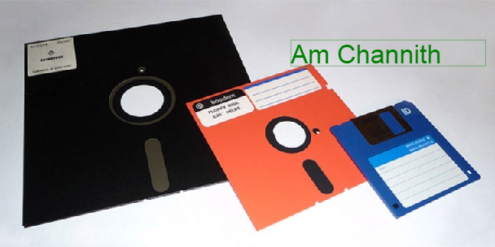

# 1. Personal Computer

## 1.1. Cases and Power Supplies
- Cases: du khe tan nhiet

- Power Supplies
- Power Supply Wattage
  - P = V x A #( 1 chieu)
  
## 1.2. Internal PC Components
----------------------------------
Data ----> Ram -----> (cache) CPU
----------------------------------

- Motherboards
- CPU
  - Controller
  - Alu
  - Register
  
```
Chon CPU:
- doi chip/main
- xung nhip (Hz)
- 
```

- Controlling System
- Memory (ROM and RAM)
  - Bo nho trong
    - ROM (Read Only Memory): chi nha san xuat co the tac dong vao, luu mai mai
    - RAM (Random Access Memory): luu tru du lieu tam thoi (man hinh xanh -> thao ram ra lau :D) phai tuong thich voi BUS (toc do du lieu), doi RAM tuong thich
      - SDRAM
      - DDRAM
      
  - Bo nho ngoai:
    - Hard disk
    - O nho di dong
    - USB, ...
    - Dia mem (bao phu boi sector)
    - SSD (chuan 32, 255): the he 6 tro len moi ho tro m2 pcie ssd, chon SSD:
      - Hieu 
      - Thich hop may minh ko?
      - doi chip co do tuong thich
      - Tuoi tho (cai them CrystalDiskInfo de xem -> chon o dia de test, test nhiet do: AID64, test Pin (so cell -> so gio)->)
    
    

Chu y:
- chip M: tiet kiem dien,
- chip H: uu ve hieu nang

- Chon RAM: dung luong theo tung nhu cau

- Cau truc o dia cung
  


## 1.3. Internal PC Component
- Adapter
  - Cards
  - External storage ( USB type C, 
- Storage Devices
- Video Ports (photoshop dung card roi, nhung dung may binh thuong thi ko tot
- General Ports
- Fans
